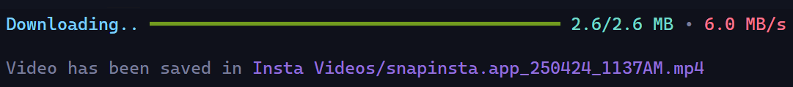

<div align="center">


**Insta-Down** is a downloader specifically designed for downloading Instagram videos. (https://snapinsta.app)



</div>

## **Installation**

**Using** `poetry`

```
git clone https://github.com/x404xx/Insta-Down.git
cd Insta-Down
poetry shell
poetry install
```

**Using** `pip`

```
git clone https://github.com/x404xx/Insta-Down.git
cd Insta-Down
virtualenv env
env/scripts/activate
pip install -r requirements.txt
```

## Insta URL Example

```
https://www.instagram.com/reel/C5WTtLuPrkq/?igsh=OGFvejljb3BmOTM4
```

## Usage

```
python -m snapinsta https://www.instagram.com/reel/C5WTtLuPrkq/?igsh=OGFvejljb3BmOTM4
```

## **Legal Disclaimer**

> This was made for educational purposes only, nobody which directly involved in this project is responsible for any damages caused. **_You are responsible for your actions._**
